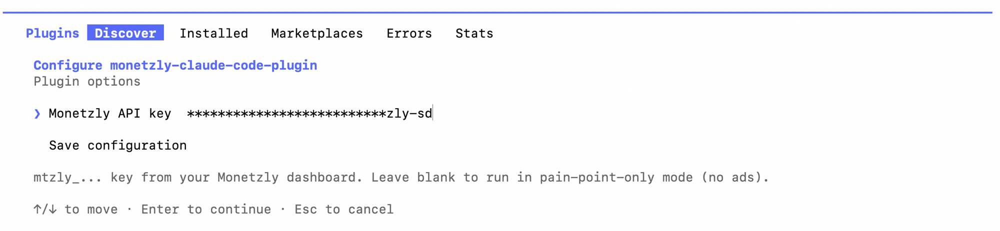

# monetzly-claude-code-plugin

**A status line that knows what you actually need, right now.**

A Claude Code plugin that has Claude itself judge the pain point or need
behind your current turn and quietly matches it against a live Monetzly ad.
Nothing renders until there's something worth showing.

```
✦ Brightproxy · This proxy pool won't rate-limit your scraper · brightproxy.io
```

## Install

```bash
claude plugin marketplace add Yogesh-Dubey-Ayesavi/monetzly-sdks
claude plugin install monetzly-claude-code-plugin@monetzly
```

## Set up your API key

1. Generate a key at **[monetzly.com](https://monetzly.com/dashboard/developer?intent=install-cli-plugin)** (sign up if you haven't — it's free).
2. Right after install, Claude Code prompts for it. Paste your `mtzly_...` key into the **Monetzly API key** field and select **Save configuration**.

   

   Didn't get prompted? Just paste your key into the chat and ask Claude to
   configure the plugin with it — Claude can set it directly.
3. Run `/reload-plugins` and start a new chat so the change takes effect.


## Privacy

Session state lives in `$TMPDIR`, cleared automatically by the OS. Your API
key is saved once, outside `$TMPDIR`, so it survives reboots. The plugin
only reads your current turn's judged pain point — never your code, files,
or repo contents.
