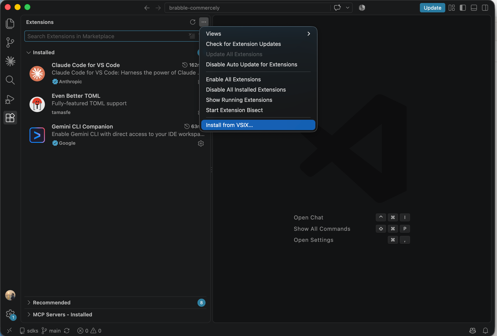
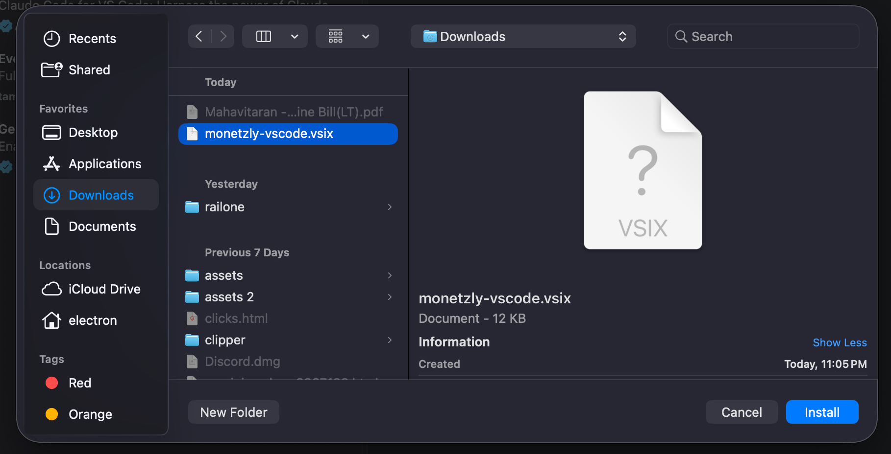
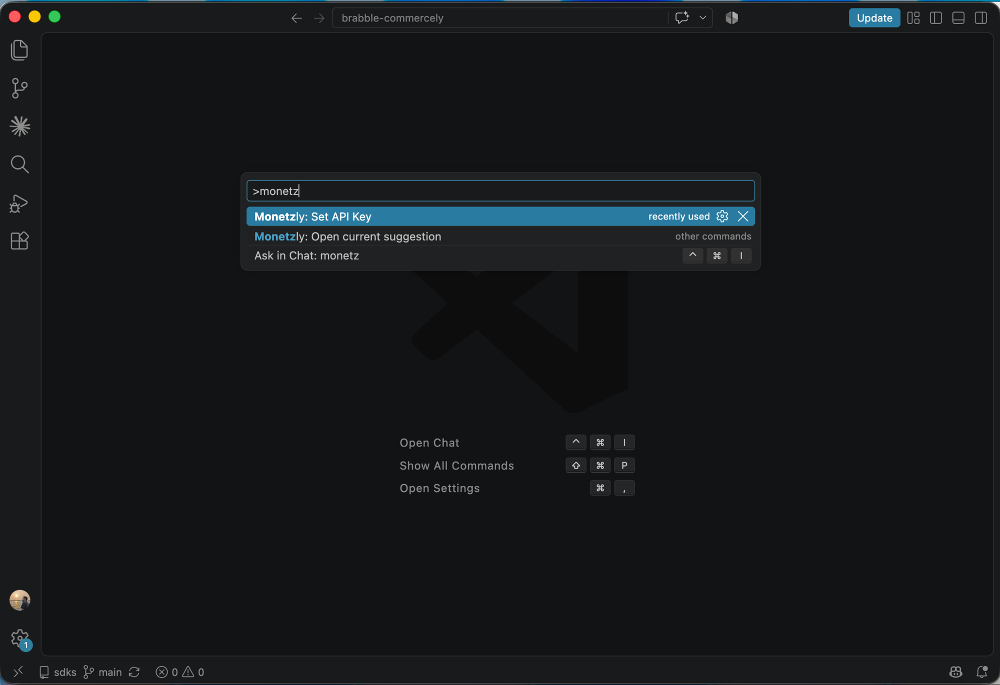
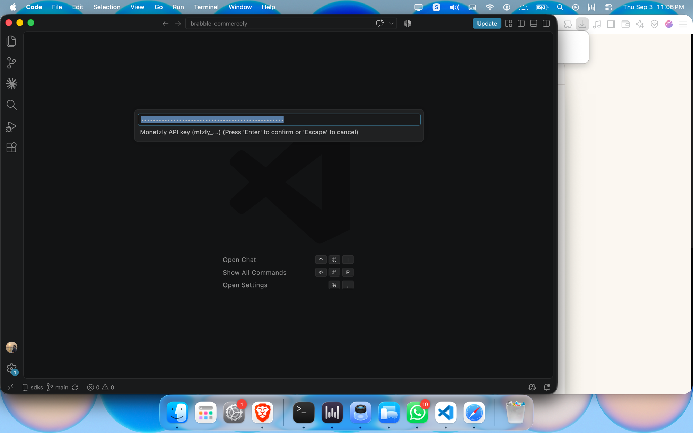
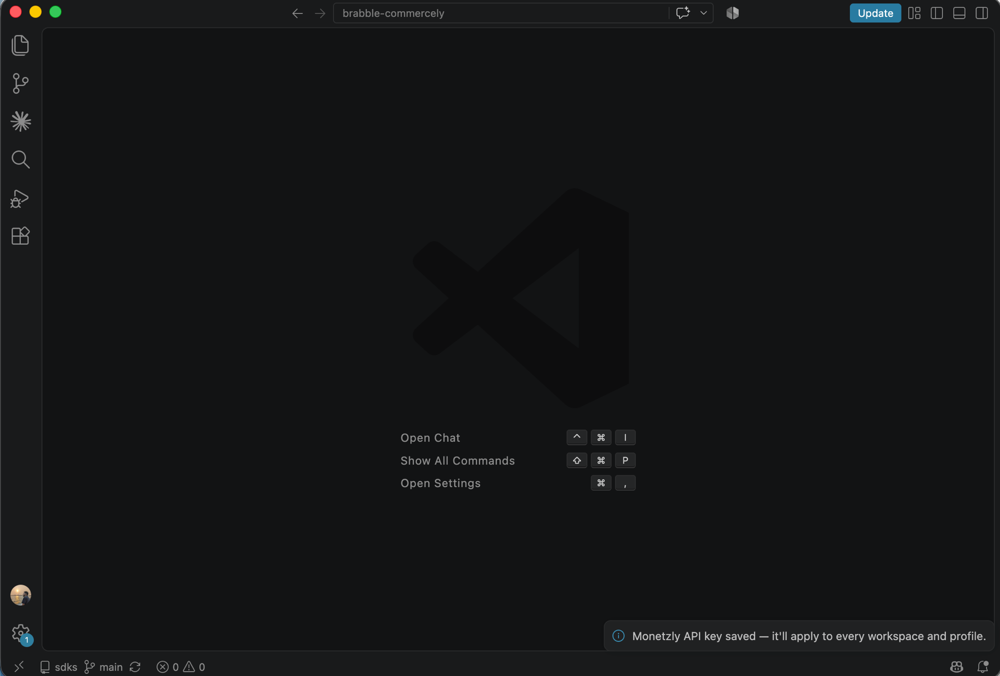

# Monetzly for VSCode

Shows a sponsored suggestion in the status bar when a Claude Code or Codex
agent working in your project signals a real pain point — a repeated
blocker, a tooling failure, a stuck moment — not idle chatter.

## How it works

1. The [`monetzly-claude-code-plugin`](https://github.com/Yogesh-Dubey-Ayesavi/monetzly-sdks/tree/main/monetzly-claude-code-plugin)
   (or its Codex counterpart) judges your agent's current pain point each
   turn and appends it to `.monetzly/events/<agent>.jsonl` in your project —
   this extension never talks to the agent directly.
2. This extension watches that folder. When a real signal shows up, it asks
   Monetzly's decision API whether a relevant ad exists for it.
3. If one matches, it renders in the status bar — brand, copy, a click-through
   to the advertiser's site — and clears itself once you've seen it.

`.monetzly/` lives inside your project (so a sandboxed agent can always
write to it) but is automatically excluded from `git status` via
`.git/info/exclude` — never committed, never touches your `.gitignore`.

## Installing the .vsix

Not yet on the Marketplace, so install the packaged `.vsix` manually:

**VS Code UI**
1. [Download `monetzly-vscode.vsix`](https://github.com/Yogesh-Dubey-Ayesavi/monetzly-sdks/raw/main/vscode-extension/monetzly-vscode.vsix) 
2. Extensions view (`Cmd+Shift+X`) → `...` menu (top-right) → **Install from VSIX...**

   

3. Select the downloaded file and hit **Install**.

   

4. Reload the window if prompted.

**CLI**
```bash
code --install-extension monetzly-vscode.vsix
```

## Setup

1. Install the extension (see above).
2. Command Palette (`Cmd+Shift+P`) → **"Monetzly: Set API Key"**.

   

3. Paste your `mtzly_...` key and hit Enter.

   

   Get a key at **[monetzly.com](https://monetzly.com/dashboard/developer?intent=install-vscode)** if you don't have one yet.
4. It's saved globally — applies to every workspace and profile, no per-project configuration needed.

   

## Commands

- **Monetzly: Set API Key** — set or update your API key.
- **Monetzly: Open current suggestion** — open the currently shown ad's link.

## Privacy

This extension only reads `.monetzly/events/` inside the currently open
workspace and calls Monetzly's API with the api key you configure. It does
not read your code, files, or any other workspace content.
